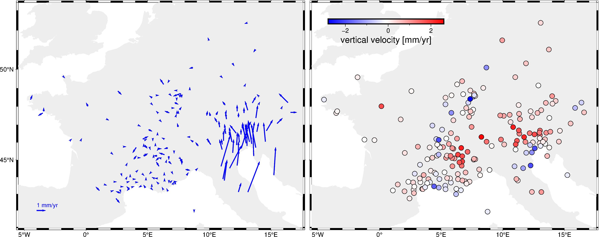

# Alps - 3D GPS velocities

This is a compilation of 3D GPS velocities for the Alps.
The horizontal velocities are reference to the Eurasian frame.
All velocity components and even the position have error estimates,
which is very useful and rare to find in a lot of datasets.

| | Summary |
|--:|:--|
| File | `alps-gps-velocity.csv.xz` |
| Size | 0.005 Mb |
| Version | [v1](https://github.com/fatiando-data/alps-gps-velocity/releases/latest) |
| DOI | https://doi.org/10.5281/zenodo.5879163 |
| License | [CC-BY](https://creativecommons.org/licenses/by/4.0/) |
| MD5 | `md5:195ee3d88783ce01b6190c2af89f2b14` |
| SHA256 | `sha256:77f2907c2a019366e5f85de5aafcab2d0e90cc2c378171468a7705cab9938584` |
| Source | Sánchez, Laura; Völksen, Christof; Sokolov, Alexandr; Arenz, Herbert; Seitz, Florian (2018): Present-day surface deformation of the Alpine Region inferred from geodetic techniques (data). PANGAEA, https://doi.org/10.1594/PANGAEA.886889 |
| Original license | [CC-BY-3.0](https://doi.org/10.1594/PANGAEA.886889) |
| Processing code | [`prepare.ipynb`](https://nbviewer.org/github/fatiando-data/alps-gps-velocity/blob/main/prepare.ipynb) |

## Changes made

> These are the changes made to the original dataset.

* Combined the data from 3 different files, keeping the 3-component
  velocities in the Eurasion frame, coordinates, uncertainties, and station ID.
* Exported to a compressed CSV file.

## About this repository

This is a place to format and prepare the original dataset for use in our
tutorials and documentation.

We include the source code that prepares the datasets for redistribution by
filtering, standardizing, converting coordinates, compressing, etc.
The goal is to make loading the data as easy as possible (e.g., a single call
to `pandas.read_csv` or `xarray.load_dataset`).
Whenever possible, the code also downloads the original data (otherwise the
original data are included in this repository).

> 💡 **Tip:** The easiest way to download this dataset is using
> [Pooch](https://www.fatiando.org/pooch), particularly to download straight
> from the DOI of a release.

## Contributing

See our [Contributing Guidelines][contrib] for information on proposing new
datasets and making changes to this repository.

## License

All Python source code is made available under the BSD 3-clause license. You
can freely use and modify the code, without warranty, so long as you provide
attribution to the authors.

Unless otherwise specified, all data files and figures created by the code are
available under the Creative Commons Attribution 4.0 License (CC-BY).

See [`LICENSE.txt`](LICENSE.txt) for the full text of each license.

The license for the original data is specified in this `README.md` file.

[contrib]: https://github.com/fatiando-data/.github/blob/main/CONTRIBUTING.md
